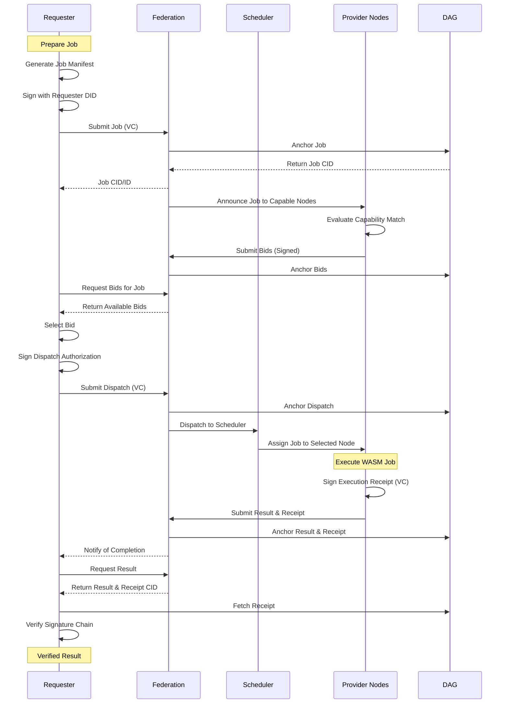

# ICN v2

[](https://codecov.io/gh/your-username/icn-v2)
<!-- Add other badges here, e.g., for security checks, crates.io version -->

A clean-slate refactor of the InterCooperative Network's federated infrastructure, emphasizing modular design, verifiable governance, and decentralized coordination.

<!-- Reminder: Security is checked in CI using cargo-audit and cargo-deny. Consider adding a badge for this if available. -->

## Key Features

- **DAG-Based Federated Ledger**: Constitutional governance using a Directed Acyclic Graph (DAG)
- **P2P DAG Synchronization**: Fully decentralized federation state synchronization over libp2p
- **TrustBundle Verification**: Quorum-based validation with cryptographic proofs
- **Multi-Node Federation**: Create, join, and participate in federated governance
- **Mesh Computation**: Latency-aware distributed compute with resource bidding

## Architecture Overview

The project follows a modular architecture organized within a Rust workspace:

```
crates/
├── runtime/icn-runtime           # Core runtime logic
├── wallet/icn-wallet             # Wallet management and transaction signing
├── agoranet/agoranet-core        # Core networking and consensus protocols
├── mesh/planetary-mesh           # Peer-to-peer mesh networking layer
├── common/
│   ├── icn-types                 # Common data types and structures (DAG, TrustBundle, etc.)
│   └── icn-identity-core         # Identity management and cryptographic primitives
└── tools/icn-cli                 # Command-line interface for interacting with the network
```

## Getting Started

To get started with ICN v2 development:

1.  **Clone the repository:**
    ```bash
    git clone https://github.com/your-username/icn-v2.git
    cd icn-v2
    ```
2.  **Install Rust:** Follow the instructions at [rust-lang.org](https://www.rust-lang.org/tools/install).
3.  **Build the workspace:**
    ```bash
    cargo build --release
    ```
4.  **Run tests:**
    ```bash
    cargo test --workspace
    ```
5.  **Try the Developer Journey:**
    ```bash
    ./scripts/dev_walkthrough.sh
    ```
    This will walk you through a complete end-to-end workflow. See the [Developer Journey Guide](docs/guides/DEVELOPER_JOURNEY.md) for details.

## Federation Genesis Example

Create a new federation with a Genesis DAG and start a node:

```bash
# Generate a DID key
icn key-gen --output founder.json

# Create a federation and start a node
icn dag sync-p2p genesis \
  --federation "my-federation" \
  --dag-dir ./data \
  --key ./founder.json \
  --policy-id "gov.icn.v1" \
  --founding-dids did:icn:founder1,did:icn:founder2 \
  --listen-addr "/ip4/0.0.0.0/tcp/9000"
```

See the [Federation Sync Guide](docs/guides/federation_sync.md) for more examples.

## Distributed Mesh Computation

Publish and execute tasks across federation nodes using latency-aware resource bidding:

```bash
# Publish a computational task
icn mesh publish-task \
  --wasm-file ./my-task.wasm \
  --input "s3://data/input1" \
  --federation "my-federation" \
  --key ./key.json \
  --dag-dir ./data

# Start a scheduler node
icn mesh scheduler \
  --federation "my-federation" \
  --key ./key.json \
  --dag-dir ./data
```

See the [Mesh Computation Guide](docs/guides/mesh_compute.md) for details.

## Mesh Job Submission Flow Diagram

For a visual representation of the mesh job submission workflow, see the diagram below. For more details and a textual description of the flow, please refer to [docs/diagrams/mesh-flow.md](docs/diagrams/mesh-flow.md).



## Contributing

Contributions are welcome! Please follow these general guidelines:

*   Fork the repository and create a new branch for your feature or bug fix.
*   Ensure your code adheres to the project's coding style (`cargo fmt`).
*   Write tests for new functionality.
*   Make sure all tests pass (`cargo test --workspace`).
*   Run linters (`cargo clippy --workspace -- -D warnings`).
*   Submit a pull request with a clear description of your changes.

## 🚧 Known Issues

- `ed25519_dalek::PublicKey` import fails during `cargo check`, even with correct dependency.
- Suspected IDE or toolchain cache issue. Reboot or `cargo clean` may not be sufficient.
- Proceeding with implementation assuming proper availability of the `PublicKey` type. 