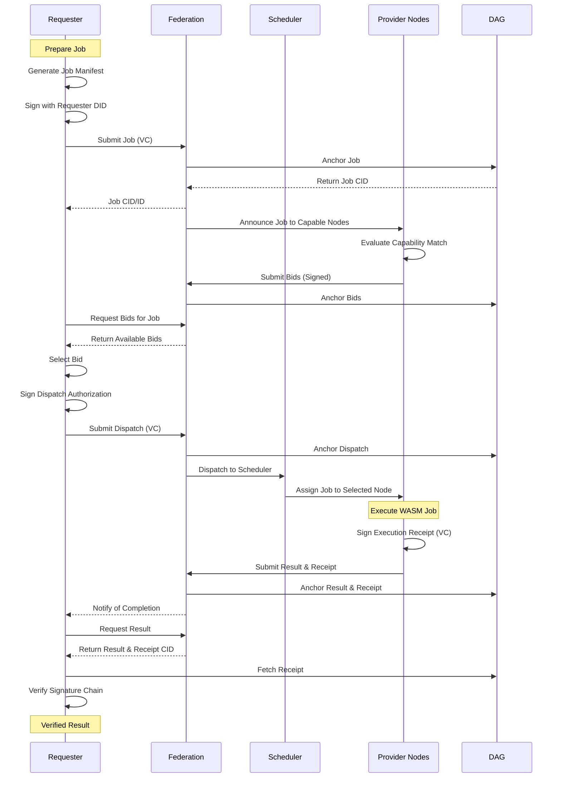

# ICN Mesh Job Submission Flow

This diagram illustrates the complete mesh job submission workflow in the InterCooperative Network, from initial job creation to result verification.

## Sequence Diagram



## Process Description

### 1. Job Submission Phase
1. **Requester** prepares a job manifest with compute requirements and parameters
2. **Requester** signs the job with their DID to create a verifiable credential (VC)
3. **Federation** receives the job and anchors it to the distributed ledger (DAG)
4. **Requester** receives confirmation with the job's unique identifier

### 2. Bidding Phase
1. **Federation** announces the job to nodes with compatible capabilities
2. **Provider Nodes** evaluate the job requirements against their resources
3. **Provider Nodes** submit signed bids with pricing and proposed execution parameters
4. **Federation** anchors bids to the DAG for transparency
5. **Requester** fetches and evaluates bids

### 3. Dispatch Phase
1. **Requester** selects a bid and signs a dispatch authorization
2. **Federation** anchors the dispatch decision to the DAG
3. **Scheduler** dispatches the job to the selected node

### 4. Execution Phase
1. **Provider Node** executes the WASM job in a secure environment
2. **Provider Node** signs an execution receipt with the result CID
3. **Federation** anchors the result and receipt to the DAG

### 5. Verification Phase
1. **Requester** fetches the result and receipt
2. **Requester** verifies the signature chain from job to dispatch to execution
3. Result is considered verified if all signatures are valid

## Trust Properties

This workflow provides several important trust properties:

- **Identity Binding**: All actions are cryptographically bound to DIDs
- **Non-Repudiation**: Signed verifiable credentials ensure parties cannot deny their actions
- **Transparent Bidding**: All bids are publicly visible and verifiable
- **Result Integrity**: Execution receipts verify computation was performed as agreed
- **Proof of Execution**: The receipt chain forms an auditable proof of the complete process

## Implementation

The ICN CLI (`icn-cli`) provides commands for each phase of this workflow:

```
icn-cli mesh submit-job     # Job submission
icn-cli mesh get-bids       # View bids
icn-cli mesh select-bid     # Select and dispatch
icn-cli mesh job-status     # Check status
icn-cli wallet verify-receipt  # Verify receipt
``` 