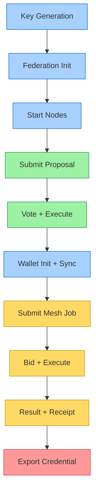

# ICN Developer Journey

This guide walks you through a complete end-to-end workflow with the InterCooperative Network (ICN). By following these steps, you'll experience the full lifecycle of a federation—from initialization through governance to mesh computation.

## Prerequisites

- Rust toolchain installed (1.70+)
- [wat2wasm](https://github.com/WebAssembly/wabt) for WebAssembly text format conversion
- jq for JSON processing (`apt install jq` or `brew install jq`)

## Understanding the Flow

The walkthrough demonstrates these core ICN capabilities:

1. **Federation Bootstrapping** - Creating a governance network
2. **Proposal & Voting** - Democratic decision-making
3. **Policy Execution** - Running governance-approved code
4. **Mesh Computation** - Distributed task execution with bidding
5. **Verifiable Credentials** - Cryptographic proof of execution

## Crate Reference

The walkthrough exercises these primary crates:

- [`icn-cli`](../../crates/tools/icn-cli) - Command-line interface
- [`icn-identity-core`](../../crates/common/icn-identity-core) - DID key management
- [`icn-types`](../../crates/common/icn-types) - Core data structures
- [`icn-runtime`](../../crates/runtime/icn-runtime) - WASM execution environment
- [`planetary-mesh`](../../crates/planetary-mesh) - P2P mesh networking
- [`agoranet-core`](../../crates/agoranet/agoranet-core) - Federation governance
- [`icn-wallet`](../../crates/wallet/icn-wallet) - Identity and credential management
- [`icn-ccl-compiler`](../../crates/ccl/icn-ccl-compiler) - Contract Chain Language

### CLI Command Coverage

| Area              | CLI Subcommand                              | Crate Involved                  |
| ----------------- | ------------------------------------------- | ------------------------------- |
| Identity          | `key-gen`                                   | `icn-identity-core`             |
| Federation Init   | `federation init`                           | `agoranet-core`, `icn-types`    |
| Proposal Workflow | `submit-proposal`, `vote`, `execute`        | `icn-runtime`, `ccl-compiler`   |
| Wallet            | `wallet init`, `sync`                       | `icn-wallet`                    |
| Mesh Job          | `mesh submit-job`, `get-bids`, `job-status` | `planetary-mesh`, `icn-runtime` |
| Receipts          | `verify-receipt`, `export-credential`       | `icn-types`, `wallet`           |

## Walkthrough Script

The complete developer journey is automated in [`scripts/dev_walkthrough.sh`](../../scripts/dev_walkthrough.sh). You can run it directly:

```bash
./scripts/dev_walkthrough.sh
```

For CI environments or faster execution:

```bash
./scripts/dev_walkthrough.sh --ci
```

To clean up the working directory after completion:

```bash
./scripts/dev_walkthrough.sh --ci --clean
```

## Step-by-Step Breakdown

### 1. Key Generation & Identity

```bash
cargo run --release -p icn-cli -- key-gen --output founder-key.json
```

This step uses [`icn-identity-core`](../../crates/common/icn-identity-core) to generate ed25519 keypairs for DIDs. These identities form the foundation of all authenticated operations in ICN.

### 2. Federation Initialization

```bash
cargo run --release -p icn-cli -- federation init \
  --config federation-init.toml \
  --output-dir ./federation-data \
  --key founder-key.json
```

Federation initialization uses [`agoranet-core`](../../crates/agoranet/agoranet-core) to create a genesis DAG block with the founding participants and governance rules.

### 3. Node Startup & P2P Networking

```bash
cargo run --release -p icn-cli -- federation node start \
  --federation-dir ./federation-data \
  --key founder-key.json \
  --data-dir ./founder-node \
  --listen-addr "/ip4/127.0.0.1/tcp/9000" \
  --api-addr "127.0.0.1:5000"
```

Nodes connect via libp2p in [`planetary-mesh`](../../crates/planetary-mesh) to form a decentralized network for DAG synchronization and message passing.

### 4. Policy Creation with CCL

```bash
cargo run --release -p icn-cli -- ccl compile \
  --input proposal.ccl \
  --output proposal.wasm
```

The Contract Chain Language (CCL) compiler [`icn-ccl-compiler`](../../crates/ccl/icn-ccl-compiler) translates human-readable governance rules into WASM for deterministic execution.

### 5-6. Proposal Submission, Voting & Execution

```bash
cargo run --release -p icn-cli -- federation submit-proposal \
  --wasm proposal.wasm \
  --metadata proposal-meta.toml \
  --key founder-key.json \
  --to http://127.0.0.1:5000
```

Proposals follow a democratic workflow in [`agoranet-core`](../../crates/agoranet/agoranet-core):
1. Submission (anchored in the DAG)
2. Voting (cryptographically signed)
3. Quorum verification
4. Execution (in the WASM runtime)

### 7. Wallet Integration

```bash
cargo run --release -p icn-cli -- wallet init \
  --key requester-key.json \
  --output-dir ./wallet-data
```

The [`icn-wallet`](../../crates/wallet/icn-wallet) manages identities, syncs with federations, and stores verifiable credentials.

### 8-11. Mesh Computation Flow

```bash
cargo run --release -p icn-cli -- mesh submit-job \
  --wasm sample-job.wasm \
  --manifest job-manifest.toml \
  --key requester-key.json \
  --to http://127.0.0.1:5000
```

The mesh computation system in [`planetary-mesh`](../../crates/planetary-mesh) orchestrates distributed tasks:
1. Job submission with resource requirements
2. Provider bidding based on capabilities
3. Bid selection and dispatch
4. Execution in the [`icn-runtime`](../../crates/runtime/icn-runtime) WASM environment
5. Result verification and receipt generation

### 12. Credential Export

```bash
cargo run --release -p icn-cli -- wallet export-credential \
  --wallet-dir ./wallet-data \
  --credential-id $RECEIPT_ID \
  --output execution-receipt.json
```

Verifiable credentials are a core product of ICN operations, providing cryptographic proof of governance and execution.

## Complete Script

Below is the full walkthrough script that automates all these steps:

```bash
#!/bin/bash
set -e

# Setup colors for terminal output
GREEN='\033[0;32m'
BLUE='\033[0;34m'
NC='\033[0m' # No Color

# Check for CI mode and clean flag
CI_MODE=false
CLEAN_UP=false

for arg in "$@"; do
  case $arg in
    --ci)
      CI_MODE=true
      SHORT_SLEEP=2
      LONG_SLEEP=5
      ;;
    --clean)
      CLEAN_UP=true
      ;;
    --interactive)
      INTERACTIVE=true
      ;;
  esac
done

if [ "$CI_MODE" = false ]; then
  SHORT_SLEEP=10
  LONG_SLEEP=15
fi

echo -e "${BLUE}==== ICN Developer Walkthrough ====${NC}"
echo "This script demonstrates a complete ICN workflow from federation bootstrap to mesh job execution."

# Create working directory
WORK_DIR="./icn_walkthrough"
mkdir -p $WORK_DIR
cd $WORK_DIR

echo -e "\n${BLUE}1. Create Federation Keys${NC}"
# Generate keys for federation participants
echo "Generating founder key..."
cargo run --release -p icn-cli -- key-gen --output founder-key.json
[ -f founder-key.json ] || { echo "❌ founder-key.json not found"; exit 1; }

echo "Generating validator1 key..."
cargo run --release -p icn-cli -- key-gen --output validator1-key.json
[ -f validator1-key.json ] || { echo "❌ validator1-key.json not found"; exit 1; }

echo "Generating validator2 key..."
cargo run --release -p icn-cli -- key-gen --output validator2-key.json
[ -f validator2-key.json ] || { echo "❌ validator2-key.json not found"; exit 1; }

# Extract DIDs for display
FOUNDER_DID=$(cargo run --release -p icn-cli -- key-gen info --file founder-key.json | grep "DID:" | awk '{print $2}')
VALIDATOR1_DID=$(cargo run --release -p icn-cli -- key-gen info --file validator1-key.json | grep "DID:" | awk '{print $2}')
VALIDATOR2_DID=$(cargo run --release -p icn-cli -- key-gen info --file validator2-key.json | grep "DID:" | awk '{print $2}')

echo -e "${GREEN}Created keys with DIDs:${NC}"
echo "Founder: $FOUNDER_DID"
echo "Validator1: $VALIDATOR1_DID"
echo "Validator2: $VALIDATOR2_DID"

if [ "$INTERACTIVE" = true ]; then
  read -p "Press Enter to continue to federation initialization..." 
fi

echo -e "\n${BLUE}2. Initialize Federation${NC}"
# Create federation initialization config
cat > federation-init.toml << EOF
federation_id = "demo-federation"
name = "Demo Federation"
description = "A demonstration federation for ICN development"

# Nodes in the federation
[[nodes]]
did = "$FOUNDER_DID"
role = "Founder"

[[nodes]]
did = "$VALIDATOR1_DID"
role = "Validator"

[[nodes]]
did = "$VALIDATOR2_DID"
role = "Validator"

# Federation policies
[policies]
voting_threshold = 0.67
min_validators = 2
max_validators = 5
EOF

# Initialize federation
echo "Initializing federation..."
mkdir -p federation-data
cargo run --release -p icn-cli -- federation init \
  --config federation-init.toml \
  --output-dir ./federation-data \
  --key founder-key.json

[ -d federation-data ] || { echo "❌ federation-data directory not found"; exit 1; }
echo -e "${GREEN}Federation initialized successfully in ./federation-data${NC}"

if [ "$INTERACTIVE" = true ]; then
  read -p "Press Enter to continue to node startup..." 
fi

echo -e "\n${BLUE}3. Start Federation Nodes${NC}"
# Start federation nodes in background
echo "Starting founder node..."
mkdir -p founder-node
cargo run --release -p icn-cli -- federation node start \
  --federation-dir ./federation-data \
  --key founder-key.json \
  --data-dir ./founder-node \
  --listen-addr "/ip4/127.0.0.1/tcp/9000" \
  --api-addr "127.0.0.1:5000" > founder-node.log 2>&1 &
FOUNDER_PID=$!

echo "Starting validator1 node..."
mkdir -p validator1-node
cargo run --release -p icn-cli -- federation node start \
  --federation-dir ./federation-data \
  --key validator1-key.json \
  --data-dir ./validator1-node \
  --listen-addr "/ip4/127.0.0.1/tcp/9001" \
  --api-addr "127.0.0.1:5001" \
  --bootstrap "/ip4/127.0.0.1/tcp/9000" > validator1-node.log 2>&1 &
VALIDATOR1_PID=$!

echo "Starting validator2 node..."
mkdir -p validator2-node
cargo run --release -p icn-cli -- federation node start \
  --federation-dir ./federation-data \
  --key validator2-key.json \
  --data-dir ./validator2-node \
  --listen-addr "/ip4/127.0.0.1/tcp/9002" \
  --api-addr "127.0.0.1:5002" \
  --bootstrap "/ip4/127.0.0.1/tcp/9000" > validator2-node.log 2>&1 &
VALIDATOR2_PID=$!

# Give nodes time to start and connect
echo "Waiting for nodes to start and connect..."
sleep $SHORT_SLEEP

if [ "$INTERACTIVE" = true ]; then
  read -p "Press Enter to continue to CCL proposal creation..." 
fi

echo -e "\n${BLUE}4. Create CCL Proposal${NC}"
# Create a simple CCL proposal
cat > proposal.ccl << EOF
// Simple resource allocation proposal
policy "resource_allocation" {
  description = "Allocate resources for mesh computation"
  
  action "allocate_compute" {
    parameters {
      max_ram_mb: u32,
      max_cpu_cores: u8,
      priority: string
    }
    
    validation {
      require(max_ram_mb <= 8192, "RAM allocation must be <= 8GB")
      require(max_cpu_cores <= 4, "CPU cores must be <= 4")
      require(priority in ["low", "medium", "high"], "Invalid priority")
    }
    
    effect {
      // This would contain the actual resource allocation logic
      log("Resources allocated: RAM={}, CPU={}, Priority={}", 
          max_ram_mb, max_cpu_cores, priority)
    }
  }
}
EOF

# Compile CCL to WASM
echo "Compiling CCL proposal to WASM..."
cargo run --release -p icn-cli -- ccl compile \
  --input proposal.ccl \
  --output proposal.wasm

[ -f proposal.wasm ] || { echo "❌ proposal.wasm not found"; exit 1; }

# Create proposal metadata
cat > proposal-meta.toml << EOF
name = "Resource Allocation Policy"
description = "Establishes resource allocation limits for mesh computation"
type = "PolicyAddition"
EOF

if [ "$INTERACTIVE" = true ]; then
  read -p "Press Enter to continue to proposal submission and voting..." 
fi

echo -e "\n${BLUE}5. Submit and Vote on Proposal${NC}"
# Submit proposal to federation
echo "Submitting proposal..."
PROPOSAL_ID=$(cargo run --release -p icn-cli -- federation submit-proposal \
  --wasm proposal.wasm \
  --metadata proposal-meta.toml \
  --key founder-key.json \
  --to http://127.0.0.1:5000 | grep "Proposal ID:" | awk '{print $3}')

[ -n "$PROPOSAL_ID" ] || { echo "❌ Failed to get proposal ID"; exit 1; }
echo -e "${GREEN}Submitted proposal: $PROPOSAL_ID${NC}"

# Vote on the proposal
echo "Voting on proposal..."
cargo run --release -p icn-cli -- federation vote \
  --proposal-id $PROPOSAL_ID \
  --key founder-key.json \
  --to http://127.0.0.1:5000 \
  --decision approve

cargo run --release -p icn-cli -- federation vote \
  --proposal-id $PROPOSAL_ID \
  --key validator1-key.json \
  --to http://127.0.0.1:5001 \
  --decision approve

echo -e "${GREEN}Votes submitted successfully${NC}"

if [ "$INTERACTIVE" = true ]; then
  read -p "Press Enter to continue to proposal execution..." 
fi

echo -e "\n${BLUE}6. Execute Approved Proposal${NC}"
# Execute the proposal
echo "Executing proposal..."
cargo run --release -p icn-cli -- federation execute \
  --proposal-id $PROPOSAL_ID \
  --key founder-key.json \
  --to http://127.0.0.1:5000

echo -e "${GREEN}Proposal executed successfully${NC}"

if [ "$INTERACTIVE" = true ]; then
  read -p "Press Enter to continue to wallet creation..." 
fi

echo -e "\n${BLUE}7. Create Wallet and Sync with Federation${NC}"
# Create a wallet for a mesh job requester
echo "Creating requester wallet..."
cargo run --release -p icn-cli -- key-gen --output requester-key.json
REQUESTER_DID=$(cargo run --release -p icn-cli -- key-gen info --file requester-key.json | grep "DID:" | awk '{print $2}')

[ -f requester-key.json ] || { echo "❌ requester-key.json not found"; exit 1; }

# Initialize wallet and sync with federation
echo "Initializing and syncing wallet..."
mkdir -p wallet-data
cargo run --release -p icn-cli -- wallet init \
  --key requester-key.json \
  --output-dir ./wallet-data

[ -d wallet-data ] || { echo "❌ wallet-data directory not found"; exit 1; }

cargo run --release -p icn-cli -- wallet sync \
  --federation-id "demo-federation" \
  --wallet-dir ./wallet-data \
  --from http://127.0.0.1:5000

echo -e "${GREEN}Wallet created and synced for $REQUESTER_DID${NC}"

if [ "$INTERACTIVE" = true ]; then
  read -p "Press Enter to continue to mesh job submission..." 
fi

echo -e "\n${BLUE}8. Submit Mesh Computation Job${NC}"
# Create a simple WASM job for mesh computation
echo "Creating sample WASM job..."
cat > sample-job.wat << EOF
(module
  (import "env" "log" (func $log (param i32 i32)))
  (memory (export "memory") 1)
  (data (i32.const 0) "Hello from ICN Mesh!")
  (func (export "_start")
    i32.const 0  ;; Pointer to message
    i32.const 19 ;; Length of message
    call $log
  )
)
EOF

# Convert WAT to WASM
echo "Converting WAT to WASM..."
wat2wasm sample-job.wat -o sample-job.wasm

[ -f sample-job.wasm ] || { echo "❌ sample-job.wasm not found"; exit 1; }

# Create job manifest
cat > job-manifest.toml << EOF
name = "Sample Job"
description = "A simple test job for the ICN mesh"
owner_did = "$REQUESTER_DID"
federation_id = "demo-federation"

# Resource requirements
[[resource_requirements]]
type = "RamMb"
value = 256

[[resource_requirements]]
type = "CpuCores"
value = 1

[parameters]
timeout_seconds = 60
EOF

# Submit job to the mesh
echo "Submitting job to mesh network..."
JOB_ID=$(cargo run --release -p icn-cli -- mesh submit-job \
  --wasm sample-job.wasm \
  --manifest job-manifest.toml \
  --key requester-key.json \
  --to http://127.0.0.1:5000 | grep "Job ID:" | awk '{print $3}')

[ -n "$JOB_ID" ] || { echo "❌ Failed to get job ID"; exit 1; }
echo -e "${GREEN}Submitted mesh job: $JOB_ID${NC}"

if [ "$INTERACTIVE" = true ]; then
  read -p "Press Enter to continue to bid selection..." 
fi

echo -e "\n${BLUE}9. Get and Accept Bids${NC}"
# Wait for bids to come in
echo "Waiting for bids..."
sleep $SHORT_SLEEP

# List bids for the job
echo "Listing bids for job..."
cargo run --release -p icn-cli -- mesh get-bids \
  --job-id $JOB_ID \
  --to http://127.0.0.1:5000

# Select first bid (assuming there's at least one)
echo "Selecting first bid..."
BID_ID=$(cargo run --release -p icn-cli -- mesh get-bids \
  --job-id $JOB_ID \
  --to http://127.0.0.1:5000 \
  --output json | jq -r '.bids[0].id')

[ -n "$BID_ID" ] || { echo "❌ Failed to get bid ID"; exit 1; }

cargo run --release -p icn-cli -- mesh select-bid \
  --job-id $JOB_ID \
  --bid-id $BID_ID \
  --key requester-key.json \
  --to http://127.0.0.1:5000

echo -e "${GREEN}Selected bid: $BID_ID${NC}"

if [ "$INTERACTIVE" = true ]; then
  read -p "Press Enter to continue to job status check..." 
fi

echo -e "\n${BLUE}10. Check Job Status and Get Results${NC}"
# Wait for job to complete
echo "Waiting for job to complete..."
sleep $LONG_SLEEP

# Check job status
echo "Checking job status..."
cargo run --release -p icn-cli -- mesh job-status \
  --job-id $JOB_ID \
  --to http://127.0.0.1:5000

# Get job results
echo "Getting job results..."
cargo run --release -p icn-cli -- mesh get-result \
  --job-id $JOB_ID \
  --to http://127.0.0.1:5000 \
  --output result.json

[ -f result.json ] || { echo "❌ result.json not found"; exit 1; }
echo -e "${GREEN}Job results saved to result.json${NC}"

if [ "$INTERACTIVE" = true ]; then
  read -p "Press Enter to continue to receipt verification..." 
fi

echo -e "\n${BLUE}11. Verify Execution Receipt${NC}"
# Extract receipt ID from result
RECEIPT_ID=$(jq -r '.receipt_id' result.json)

[ -n "$RECEIPT_ID" ] || { echo "❌ Failed to get receipt ID"; exit 1; }

# Verify execution receipt
echo "Verifying execution receipt..."
cargo run --release -p icn-cli -- mesh verify-receipt \
  --receipt-id $RECEIPT_ID \
  --to http://127.0.0.1:5000

echo -e "${GREEN}Receipt verified successfully${NC}"

if [ "$INTERACTIVE" = true ]; then
  read -p "Press Enter to continue to credential export..." 
fi

echo -e "\n${BLUE}12. Export Credentials from Wallet${NC}"
# Export the execution credential from wallet
echo "Exporting execution credential..."
cargo run --release -p icn-cli -- wallet export-credential \
  --wallet-dir ./wallet-data \
  --credential-id $RECEIPT_ID \
  --output execution-receipt.json

[ -f execution-receipt.json ] || { echo "❌ execution-receipt.json not found"; exit 1; }
echo -e "${GREEN}Execution credential exported to execution-receipt.json${NC}"

if [ "$INTERACTIVE" = true ]; then
  read -p "Press Enter to clean up..." 
fi

echo -e "\n${BLUE}13. Clean Up${NC}"
# Stop federation nodes
echo "Stopping federation nodes..."
kill $FOUNDER_PID $VALIDATOR1_PID $VALIDATOR2_PID

echo -e "\n${GREEN}Developer walkthrough completed successfully!${NC}"
echo "The following artifacts were created:"
echo "- Federation data: ./federation-data/"
echo "- Node data: ./founder-node/, ./validator1-node/, ./validator2-node/"
echo "- Wallet data: ./wallet-data/"
echo "- Job result: ./result.json"
echo "- Execution receipt: ./execution-receipt.json"

# Perform cleanup if requested
if [ "$CLEAN_UP" = true ]; then
  echo -e "\nCleaning up working directory..."
  cd ..
  rm -rf "$WORK_DIR"
  echo "Cleanup complete."
fi
```

## Developer Journey Diagram

The complete workflow is visualized below:



## Learning More

For deeper understanding of specific components:

- [Architecture Overview](../architecture/ARCHITECTURE.md) - System design
- [Mesh Computation Guide](./mesh_compute.md) - Detailed mesh processes
- [Federation Sync Guide](./federation_sync.md) - P2P DAG synchronization
- [Runtime Reference](../architecture/runtime.md) - WASM execution environment

## Try It Interactive Mode

For an interactive experience, you can run the walkthrough with prompts:

```bash
./scripts/dev_walkthrough.sh --interactive
```

This mode pauses between steps, allowing you to examine state and learn in detail.

---

*Note: This guide assumes you're running from the repository root. All paths are relative to that location.* 