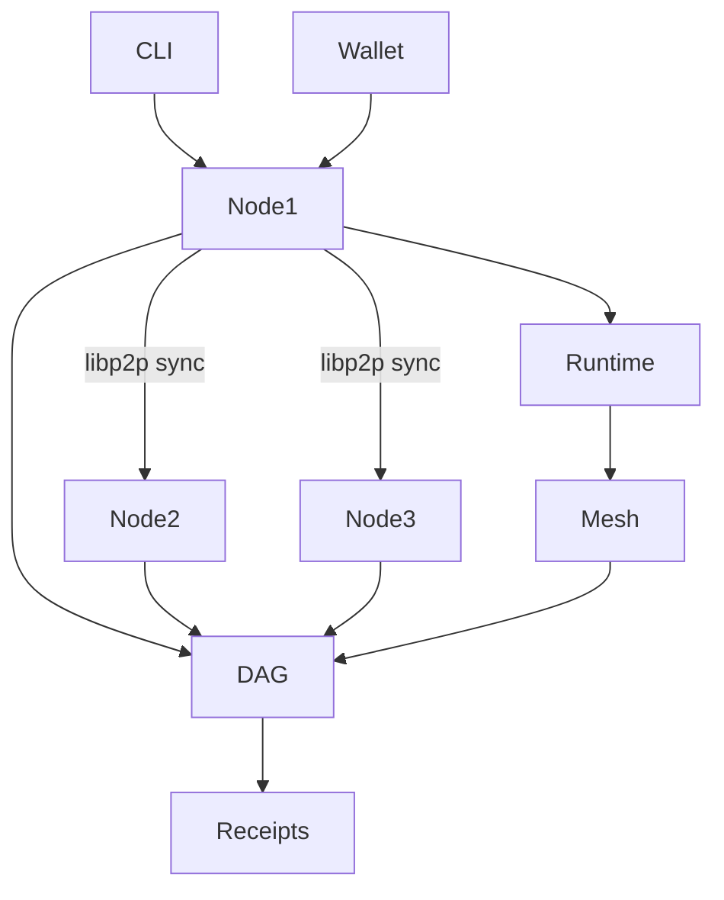

# 🚀 ICN Developer Onboarding: Compile & Run Test Federation

> See also: [DEVELOPER_GUIDE.md](../architecture/DEVELOPER_GUIDE.md) | [Project README](https://github.com/InterCooperative-Network/icn-v2/blob/main/README.md)

This guide walks you through **compiling the ICN v2 codebase**, **running a 3-node federation**, and **verifying task execution and DAG anchoring**.

---

## ✅ Prerequisites

```bash
# Core dependencies
sudo apt install -y build-essential libssl-dev pkg-config curl git

# Install Rust (recommended: stable)
curl https://sh.rustup.rs -sSf | sh
rustup default stable

# Install `just` for task automation (optional but recommended)
cargo install just

# Docker for federation infra
sudo apt install docker.io docker-compose
```

---

## 🧱 1. Clone and Build the Project

```bash
git clone https://github.com/intercooperative/icn-v2.git
cd icn-v2

# Clean build
cargo clean
cargo check --workspace
cargo build --release
```

---

## 🛠️ 2. Bootstrap a Local Federation

Use the preconfigured federation Docker setup:

```bash
cd demo/federation

# Initialize secrets, keys, and config
./init_federation.sh

# Start the 3-node federation
docker-compose up -d

# Check node health
curl http://localhost:5001/health
curl http://localhost:5002/health
curl http://localhost:5003/health
```

---

## 🧪 3. Submit a Proposal via CLI

```bash
# Submit a proposal to node 1
cd ../../crates/tools/icn-cli
cargo run -- federation submit-proposal \
  --to http://localhost:5001 \
  --file ../../examples/sample_proposal.toml
```

---

## 🔁 4. Execute and Anchor Results

```bash
# Vote and execute via CLI (simplified)
cargo run -- federation vote --proposal-id <id>
cargo run -- federation execute --proposal-id <id>
```

All execution results are:

* **anchored into the DAG**
* **signed and issued as ExecutionReceipt VC**
* **synchronized via libp2p**

---

## 🧪 5. Run a Mesh Job

```bash
# Submit a mesh job to the network
cargo run --release --bin icn-cli -- mesh submit-job \
  --manifest ../../examples/sample_job.toml \
  --to http://localhost:5001
```

View results:

```bash
cargo run --release --bin icn-cli -- mesh job-status --job-id <id>
```

---

## 🔍 6. Verify Receipts and Credentials

```bash
# Fetch and verify ExecutionReceipt
cargo run -- wallet verify-receipt --id <receipt_cid>
```

Receipts are cryptographically signed and DAG-anchored.

---

## 🧰 Optional: Use Justfile for Common Tasks

```bash
just build
just run-federation
just submit-proposal
just test
```

A `justfile` is provided at the repo root to wrap common commands.

---

## 📡 Federation Diagram (Quick Reference)



---

## ✅ Confirm It Works

* 🟢 `docker ps` shows all 3 federation nodes running
* 🟢 DAG is being updated with proposals, votes, execution receipts
* 🟢 Mesh tasks complete and receipts are anchored
* 🟢 CLI can verify any result or credential end-to-end

---

For more, see [DEVELOPER_GUIDE.md](../architecture/DEVELOPER_GUIDE.md) and the main [README](https://github.com/InterCooperative-Network/icn-v2/blob/main/README.md). 