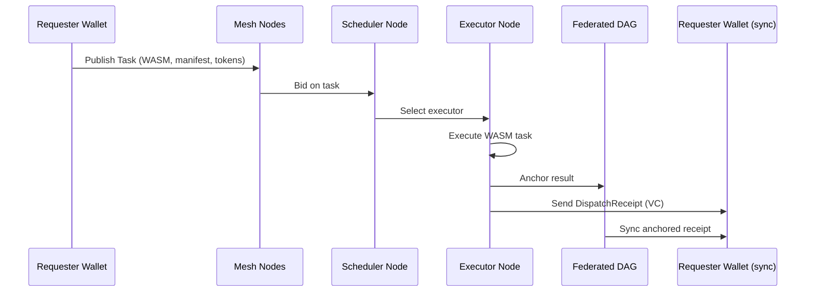
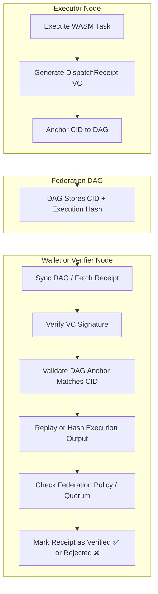

# Mesh Computation Guide

This guide explains how to use ICN's distributed mesh computation system, which enables latency-aware, resource-efficient task distribution across federation nodes.

## Overview

The mesh computation system allows you to:

1. Publish computational tasks as WASM modules
2. Receive resource bids from nodes based on latency, compute capacity, and reputation
3. Execute tasks on the most suitable nodes
4. Record verifiable execution results in the DAG

## Task Lifecycle Overview

This diagram illustrates the core flow of decentralized task execution across mesh nodes. It helps clarify:
*   What roles (requester, bidder, scheduler, executor) exist
*   How WASM tasks move through the system
*   Where DAG anchoring and Verifiable Credentials (VCs) enter the process



## Prerequisites

- ICN CLI installed
- A federation with at least two nodes (see [Federation Sync Guide](federation_sync.md))
- WebAssembly module(s) for computation

## Publishing a Task

First, prepare a WebAssembly module that contains your computational task:

```bash
# Example: Compile a Rust program to WASM (requires wasm-pack)
wasm-pack build --target nodejs
```

Then publish the task to your federation:

```bash
icn mesh publish-task \
  --wasm-file ./target/wasm32-unknown-unknown/release/my_task.wasm \
  --input "s3://mybucket/dataset1" \
  --input "ipfs://QmHash123" \
  --max-latency 500 \
  --memory 1024 \
  --cores 2 \
  --priority 75 \
  --federation "my-federation" \
  --key ./key.json \
  --dag-dir ./dag-data
```

This will:
1. Create a `TaskTicket` node in the DAG
2. Compute a hash of your WASM file for verification
3. Broadcast the task ticket to federation peers
4. Return a CID that identifies your task

## Bidding on Tasks

Nodes with available resources can bid on published tasks:

```bash
icn mesh bid \
  --task-cid QmTaskCid123 \
  --latency 50 \
  --memory 2048 \
  --cores 4 \
  --reputation 85 \
  --renewable 70 \
  --key ./compute-node.json \
  --dag-dir ./dag-data
```

The bid includes:
- Current latency to reach the node (in milliseconds)
- Available memory and CPU cores
- Reputation score of the bidder
- Percentage of renewable energy used (optional sustainability metric)

## Running a Scheduler

A scheduler node automatically matches tasks with the best bids:

```bash
icn mesh scheduler \
  --federation "my-federation" \
  --key ./scheduler.json \
  --dag-dir ./dag-data \
  --listen "/ip4/0.0.0.0/tcp/9001"
```

The scheduler:
1. Monitors the DAG for new `TaskTicket` and `TaskBid` nodes
2. Evaluates bids using a scoring function that considers latency, resources, and reputation
3. Selects the optimal bid for each task
4. Creates task assignments in the DAG

### Capability-Based Scheduling

You can specify capability requirements to filter nodes based on their manifests before considering bids:

```bash
icn mesh scheduler \
  --federation "my-federation" \
  --key ./scheduler.json \
  --dag-dir ./dag-data \
  --listen "/ip4/0.0.0.0/tcp/9001" \
  --require "arch=x86_64" \
  --require "min_cores=4" \
  --require "min_ram_mb=8192" \
  --require "gpu_api=cuda" \
  --require "gpu_vram_mb=4096" \
  --require "min_renewable=50"
```

Multiple `--require` flags can be added, each with a key=value pair. The scheduler will only consider nodes
whose manifests match all the specified requirements.

#### Available Capability Requirements

| Key | Value Format | Description |
|-----|--------------|-------------|
| `arch` | `x86_64`, `arm64`, `riscv32`, `riscv64`, `wasm32` | Required CPU architecture |
| `min_cores` | Integer | Minimum number of CPU cores |
| `min_ram_mb` | Integer | Minimum RAM in megabytes |
| `min_storage_gb` | Integer | Minimum storage in gigabytes |
| `gpu_vram_mb` | Integer | Minimum GPU VRAM in megabytes |
| `gpu_cores` | Integer | Minimum number of GPU cores |
| `gpu_tensor_cores` | `true`/`false` | Whether tensor cores are required |
| `gpu_api` | `cuda`, `vulkan`, `metal`, `webgpu`, `opencl`, `directx` | Required GPU API |
| `gpu_feature` | String | Required GPU feature (can be specified multiple times) |
| `sensor` | `type:protocol:active` | Required sensor type, optional protocol, and active status |
| `actuator` | `type:protocol:active` | Required actuator type, optional protocol, and active status |
| `min_renewable` | Integer (0-100) | Minimum renewable energy percentage |
| `energy_source` | `grid`, `solar`, `wind`, `battery`, `generator` | Required energy source |
| `requires_battery` | `true`/`false` | Whether battery power is required |
| `requires_charging` | `true`/`false` | Whether charging status is required |
| `max_power_watts` | Decimal | Maximum power consumption in watts |

#### Example Use Cases

**AI Workloads**:
```bash
icn mesh scheduler \
  --federation "ai-federation" \
  --key ./scheduler.json \
  --dag-dir ./dag-data \
  --require "gpu_api=cuda" \
  --require "gpu_vram_mb=8192" \
  --require "gpu_tensor_cores=true"
```

**IoT Sensor Network**:
```bash
icn mesh scheduler \
  --federation "iot-federation" \
  --key ./scheduler.json \
  --dag-dir ./dag-data \
  --require "sensor=temperature:i2c:true" \
  --require "sensor=humidity:i2c:true" \
  --require "requires_battery=true"
```

**Green Computing**:
```bash
icn mesh scheduler \
  --federation "green-federation" \
  --key ./scheduler.json \
  --dag-dir ./dag-data \
  --require "min_renewable=75" \
  --require "energy_source=solar" \
  --require "max_power_watts=50"
```

## Capability Scoring and Node Selection

Schedulers determine the best node to execute a task by evaluating bids using a scoring formula that balances technical capability, network metrics, and trust incentives.

```mermaid
flowchart TD
    subgraph Task Publisher (Wallet)
        A1[Publish Task]
        A2[Manifest Includes Required Capabilities]
    end

    subgraph Mesh Nodes
        B1[Node A: Submit Capabilities]
        B2[Node B: Submit Capabilities]
        B3[Node C: Submit Capabilities]
    end

    subgraph Scheduler Node
        C1[Match Capabilities Against Requirements]
        C2[Fetch Node Reputation + Latency]
        C3[Apply Scoring Formula]
        C4[Select Best Executor]
        C5[Notify Executor & Log Selection]
    end

    A1 --> A2 --> C1
    B1 --> C1
    B2 --> C1
    B3 --> C1
    C1 --> C2 --> C3 --> C4 --> C5
```

### Scoring Flow Overview

1. **Task Publication**

   * The task manifest specifies the required capabilities (e.g., memory, CPU, GPU, architecture).

2. **Bid Submission**

   * Mesh nodes submit their capabilities and availability.
   * These include static specs (arch, cores), dynamic metrics (latency, bandwidth), and optional incentives (staked tokens, history).

3. **Scheduler Matching**

   * The scheduler compares node capabilities to the manifest requirements.
   * Nodes that don't meet minimum thresholds are filtered out.

4. **Score Calculation**

   * The scheduler computes a score for each candidate using a weighted formula:

     ```
     score = capability_match × reputation_factor × incentive_weight × latency_bonus
     ```
   * Policies may be federation-defined and programmable.

5. **Executor Selection**

   * The top-scoring node is selected as executor.
   * The result is recorded in the DAG or shared with the requester.

### Configurable Policies

Federations or task publishers may modify:

* Minimum score thresholds
* Reputation curve or decay rate
* Token incentives/staking weights
* Architecture or region affinity

This scoring mechanism ensures **fair, auditable, and incentive-aligned** task execution across the global mesh.

## Executing Tasks

When a bid is accepted, the winning node executes the task:

```bash
icn mesh execute \
  --task-cid QmTaskCid123 \
  --bid-cid QmBidCid456 \
  --key ./compute-node.json \
  --dag-dir ./dag-data \
  --output-dir ./results
```

After execution:
1. Results are saved to the specified output directory
2. An `ExecutionReceipt` is anchored to the DAG
3. The receipt contains execution metrics and results hash

## DispatchReceipt Verification Flow

This flow illustrates how `DispatchReceipt` Verifiable Credentials (VCs) are validated across federations to ensure task execution integrity.



### Verification Steps

1. **Execution and Receipt Generation**

   * The executor node runs the WASM task and issues a `DispatchReceipt` (a Verifiable Credential).
   * This includes: the task hash, input/output CID, signature(s), and metadata.

2. **DAG Anchoring**

   * The executor anchors the CID to the federated DAG, enabling traceable execution lineage.

3. **Receipt Synchronization**

   * A wallet or federation node fetches the receipt and associated DAG data.

4. **Cryptographic Verification**

   * The verifier checks:

     * VC signature validity against the executor's DID.
     * CID consistency with the receipt's contents.
     * Output hash matches expected result (or replays the WASM deterministically).

5. **Policy and Quorum Enforcement**

   * If the federation requires threshold/multi-signature validation, the verifier confirms all required endorsements.

6. **Trust Marking**

   * The wallet or node marks the receipt as ✅ **Verified** or ❌ **Rejected**, and can share this judgment with other peers.

This process ensures that execution is not only decentralized, but **cryptographically verifiable**, enabling secure cross-federation computation.

## Federated Economic Enforcement

Each federation defines its own scoped economic policy, controlling how tokens are authorized and metered during task execution.

```mermaid
flowchart TD
    subgraph Federation Config
        A1[Economic Policy Defined (token_type, rules, caps)]
    end

    subgraph Wallet
        B1[Create Task Manifest]
        B2[Specify Token Allocation]
        B3[Submit to Federation]
    end

    subgraph Runtime Node
        C1[Load Federation Policy]
        C2[Check Authorization]
        C3[Execute Metered WASM]
        C4[Record Resource Usage]
        C5[Anchor ExecutionReceipt]
    end

    subgraph DAG + Verifier
        D1[Sync ExecutionReceipt VC]
        D2[Verify Token Usage Against Policy]
        D3[Confirm Economic Validity]
    end

    A1 --> C1
    B1 --> B2 --> B3 --> C2
    C2 --> C3 --> C4 --> C5 --> D1
    D1 --> D2 --> D3
```

### Economic Enforcement Steps

1. **Federation Policy Definition**

   * The federation specifies allowed `token_type`s, usage caps, minimum balance rules, and metering granularity.
   * These policies are stored on-chain or bundled with the federation's config and loaded into the runtime environment.

2. **Task Publication with Allocation**

   * Requesters submit a task with:

     * `wasm_file`
     * `token_type`
     * `token_amount`
     * `target_federation`
   * The manifest is cryptographically signed and submitted via the wallet.

3. **Runtime Economic Checks**

   * During execution, the WASM task:

     * Calls `host_check_resource_authorization` to verify allowed token use.
     * Calls `host_record_resource_usage` to record final consumption.
   * If authorization fails, execution is rejected and the error is anchored.

4. **ExecutionReceipt + Verification**

   * After execution, a signed `ExecutionReceipt` VC is anchored in the DAG.
   * It includes:

     * `token_type`, `amount_spent`
     * Policy reference (e.g., `policy_hash`)
     * Execution hash, output CID
   * Other nodes or wallets can verify:

     * Signature authenticity
     * Conformance with the declared economic policy

This mechanism ensures that **tasks cannot exceed their authorized economic scope**, creating a transparent, verifiable link between **resource use and governance-defined economic rules**.

## Bid Scoring Formula

The default bid scoring formula prioritizes low latency, high reputation, and efficient resource usage:

```
score = latency * (100 - reputation) / (memory * cores * (1 + renewable/100))
```

Lower scores are better. This balances:
- Fast response time (low latency)
- Trusted nodes (high reputation)
- Sufficient resources (memory and cores)
- Green computing (renewable energy percentage)

## Example: Distributed Image Processing

Let's walk through a complete example:

```bash
# Node 1: Create federation and publish an image processing task
icn dag sync-p2p genesis --federation "image-proc" --dag-dir ./node1-data --key ./founder.json --policy-id "compute.v1" --founding-dids did:example:node1,did:example:node2
icn mesh publish-task --wasm-file ./image-processor.wasm --input "s3://images/batch1/*" --federation "image-proc" --key ./founder.json --dag-dir ./node1-data

# Node 2: Join federation and start scheduler
icn dag sync-p2p auto-sync --federation "image-proc" --dag-dir ./node2-data --bootstrap-peers "/ip4/192.168.1.100/tcp/9000/p2p/QmPeer1"
icn mesh scheduler --federation "image-proc" --key ./node2.json --dag-dir ./node2-data

# Node 3: Join federation and bid on task
icn dag sync-p2p auto-sync --federation "image-proc" --dag-dir ./node3-data --bootstrap-peers "/ip4/192.168.1.100/tcp/9000/p2p/QmPeer1"
icn mesh bid --task-cid QmTask123 --latency 25 --memory 4096 --cores 8 --key ./node3.json --dag-dir ./node3-data

# Node 3: Execute task when bid is selected
icn mesh execute --task-cid QmTask123 --bid-cid QmBid456 --key ./node3.json --dag-dir ./node3-data --output-dir ./processed-images
```

## Visualizing Computation

To visualize the computational graph:

```bash
icn dag visualize --dag-dir ./dag-data --output compute-graph.dot --max-nodes 100
dot -Tpng compute-graph.dot -o compute-graph.png
```

The visualization will show:
- Task tickets (yellow)
- Bids (yellow)
- Execution receipts (green)
- Connections between related nodes

## Next Steps

- Create custom WASM tasks with the ICN WASM SDK (coming soon)
- Implement a custom bid scoring function for your federation's needs
- Set up automatic task publishing from your applications 

# ICN Mesh Compute Layer

The mesh compute layer provides a decentralized compute fabric for the InterCooperative Network, allowing tasks to be automatically matched with nodes based on capabilities.

## Node Capabilities

Each node in the network publishes a `NodeManifest` that describes its capabilities, including:

- Hardware (CPU, GPU, RAM, storage)
- Sensors and actuators
- Energy profile
- Trust firmware hash

Manifests are published to the DAG and gossiped across the network, forming a live index of available compute resources.

## Manifests and Verification

Node manifests are cryptographically signed by the node's DID key and published as verifiable credentials in the network. This enables capability-based scheduling with strong security guarantees.

### Manifest Verification

The ICN mesh implements signature verification for all node manifests to ensure only authorized nodes can participate in the network. This verification happens at multiple levels:

```rust
// Create a capability index with strict verification
let config = CapabilityIndexConfig {
    verify_signatures: true,
    require_valid_signatures: true,
    trusted_dids: Some(vec![trusted_did1, trusted_did2]),
};

let cap_index = CapabilityIndex::with_config(dag_store, config);
```

Verification options include:

- **verify_signatures**: When enabled, checks the manifest signature against the node's DID
- **require_valid_signatures**: When enabled, rejects manifests with invalid signatures
- **trusted_dids**: Optional list of DIDs that are allowed to publish manifests

You can use the new audit commands to inspect manifest signatures:

```bash
# View a specific manifest with signature verification
icn mesh audit --audit-type manifest --cid <manifest-cid> --dag-dir ./dag-data --federation "my-federation"
```

### Security Considerations

When operating a mesh scheduler, consider the following security practices:

1. **Always verify signatures** by setting `require_valid_signatures` to true
2. **Maintain a trusted DID list** for highly secure environments
3. **Periodically audit dispatches** using `icn mesh audit` commands
4. **Monitor node behavior** and revoke trust from misbehaving nodes

## Task Scheduling

Tasks are scheduled based on capability requirements:

```bash
# Schedule a task with specific capability requirements
icn mesh scheduler \
  --federation "my-federation" \
  --key ./scheduler.json \
  --dag-dir ./dag-data \
  --require "arch=x86_64" \
  --require "min_cores=4" \
  --require "min_ram_mb=8192" \
  --require "gpu_api=cuda"
```

### Capability Requirements

You can specify requirements for any capability exposed in node manifests:

- **Hardware**: `arch`, `min_cores`, `min_ram_mb`, `min_storage_bytes`
- **GPU**: `gpu_api`, `min_gpu_vram`, `gpu_tensor_cores`, `gpu_features`
- **Sensors**: `sensor=type`, `sensor_protocol=value`
- **Energy**: `min_renewable=75`, `energy_source=solar`
- **Custom**: Any key-value pair for extension capabilities

Multiple requirements combine with AND logic - all must be satisfied.

## Auditing and Transparency

All scheduler decisions are recorded in the DAG for complete transparency and auditability. 

### Viewing Dispatch Records

You can view and analyze capability-based scheduling decisions:

```bash
# List recent dispatch records
icn mesh audit --audit-type dispatch --dag-dir ./dag-data --federation "my-federation"

# View details of a specific dispatch decision
icn mesh audit --audit-type dispatch --cid <record-cid> --dag-dir ./dag-data --federation "my-federation"

# Analyze capability requirements across all tasks
icn mesh audit --audit-type requirements --dag-dir ./dag-data --federation "my-federation"

# Filter dispatch records by requirement
icn mesh audit --audit-type dispatch --requirement "arch=x86_64" --requirement "gpu_api=cuda" \
  --dag-dir ./dag-data --federation "my-federation"
```

The audit system provides complete transparency into how tasks are matched to nodes and which capability requirements are most frequently used in your federation.

### Dispatch Receipts and Verifiable Credentials

ICN stores all task dispatch decisions as signed W3C Verifiable Credentials in the DAG, creating a cryptographically verifiable audit trail. These credentials:

1. Are signed by the scheduler's DID key
2. Contain full details of the capability requirements used
3. Document which node was selected and why
4. Include the original task request and bid information
5. Provide comprehensive proof of the decision-making process

This enables:
- **Regulatory compliance**: Provide auditors with cryptographic proof of fair resource allocation
- **Dispute resolution**: Verify which node was selected and based on what criteria
- **Capability analytics**: Analyze which capabilities are most in-demand across your federation
- **Optimization guidance**: Identify capability gaps in your federation's nodes

Here's how a dispatch receipt is structured:

```json
{
  "@context": [
    "https://www.w3.org/2018/credentials/v1",
    "https://icn.network/context/mesh-compute/v1"
  ],
  "id": "urn:icn:dispatch:b4c7a18e-3f7d-4bad-9c0e-a8d1ea10ca63",
  "type": ["VerifiableCredential", "DispatchReceipt"],
  "issuer": "did:icn:scheduler123",
  "issuanceDate": "2023-08-15T14:30:45Z",
  "credentialSubject": {
    "id": "did:icn:requestor456",
    "taskRequest": {
      "wasm_hash": "0xabcdef1234567890",
      "wasm_size": 1048576,
      "inputs": ["ipfs://QmData1", "ipfs://QmData2"],
      "max_latency_ms": 500,
      "memory_mb": 2048,
      "cores": 4
    },
    "capabilities": {
      "arch": "x86_64",
      "min_cores": 4,
      "min_ram_mb": 8192,
      "gpu_requirements": {
        "required_api": ["cuda"],
        "min_vram_mb": 4096
      }
    },
    "selectedNode": "did:icn:node789",
    "score": 0.92,
    "matchingNodeCount": 5,
    "bid": {
      "bidCid": "QmBidHash1234",
      "latency": 25,
      "memory": 16384,
      "cores": 8,
      "reputation": 95,
      "renewable": 80
    }
  },
  "proof": {
    "type": "Ed25519Signature2020",
    "verificationMethod": "did:icn:scheduler123#keys-1",
    "created": "2023-08-15T14:30:45Z",
    "proofValue": "z3FLC2EPzrgL1rFFfPMHGYI2aqLjnbTGAE"
  }
}
```

### Security and Verification

All dispatch records can be independently verified using the scheduler's public DID key. The ICN CLI automatically verifies signatures when displaying dispatch records:

```bash
# View details of a verified dispatch record
icn mesh audit --audit-type dispatch --cid QmDispatchCid123 --verify-signatures \
  --dag-dir ./dag-data --federation "my-federation"
```

For federation synchronization, all dispatch records are included as part of the DAG sync process, allowing all participants to independently verify the fairness and correctness of task scheduling decisions.

## APIs

Beyond the CLI, the mesh compute layer exposes programmatic APIs:

```rust
// Create a capability selector
let mut selector = CapabilitySelector::new();
selector.arch = Some(Architecture::X86_64);
selector.min_cores = Some(4);
selector.min_ram_mb = Some(8192);

if let Some(gpu_req) = &mut selector.gpu_requirements {
    gpu_req.min_vram_mb = Some(4096);
    gpu_req.required_api = Some(vec![GpuApi::Cuda]);
}

// Create a task request
let request = TaskRequest {
    requestor: did,
    wasm_hash: "task-wasm-module-hash",
    wasm_size: 1024 * 1024,
    inputs: vec!["ipfs://data1", "ipfs://data2"],
    max_latency_ms: 1000,
    memory_mb: 1024,
    cores: 2,
    priority: 50,
    timestamp: Utc::now(),
    federation_id: "my-federation".to_string(),
};

// Dispatch the task with capability requirements
let result = scheduler.dispatch(request, Some(selector)).await?;
```

## Future Extensions

The ICN mesh compute layer is continuously evolving with planned features including:

- **Reputation-based scheduling** using verifiable credential attestations
- **Energy-aware task routing** prioritizing renewable energy sources
- **Federated learning support** for privacy-preserving distributed ML
- **Mesh resource tokenization** for economic incentives 